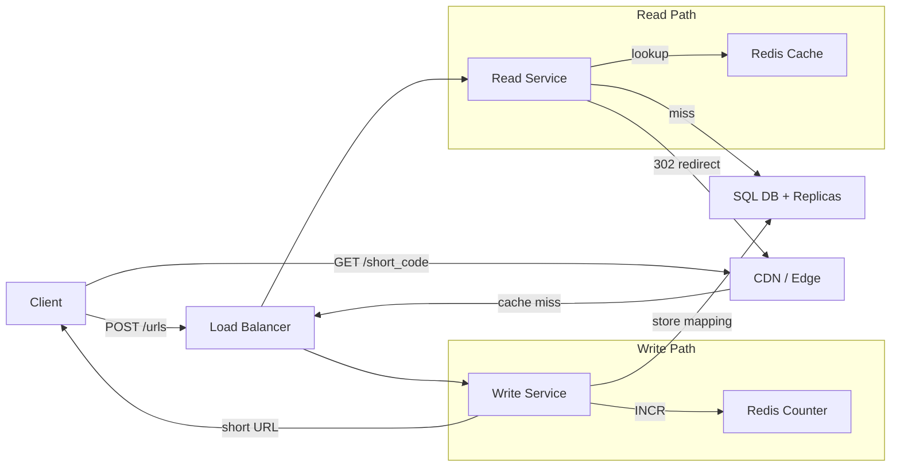

## Overview

Design a URL shortening service where users submit a long URL and receive a short, shareable link. Accessing the short link redirects the user to the original URL.

---

## Functional Requirements

1. **Shorten** — submit a long URL and receive a shortened version
2. **Custom alias** — optionally specify a custom alias (e.g. `short.ly/my-alias`)
3. **Expiration** — optionally set an expiration date on a shortened URL
4. **Redirect** — access the original URL via the shortened URL

### Out of Scope

- User authentication and account management
- Analytics on link clicks

---

## Non-Functional Requirements

1. **Uniqueness** — each short code maps to exactly one long URL
2. **Low latency** — redirects complete in under 100ms
3. **Highly available** — 99.99% uptime; availability over consistency
4. **Scalable** — support 1B shortened URLs and 100M DAU

> The read-to-write ratio is heavily skewed toward reads (roughly 1000 clicks per 1 new URL created). This shapes nearly every design decision.

---

## Core Entities

| Entity | Description |
| --- | --- |
| **Short URL** | The generated or custom short code and its metadata |
| **Original URL** | The long URL the short code maps to |
| **User** | The user who created the shortened URL |

### DB Schema

```
short_code     VARCHAR  (PK)
long_url       TEXT
custom_alias   VARCHAR  (nullable)
expiration     TIMESTAMP (nullable)
created_at     TIMESTAMP
```

---

## API Design

```python
# Shorten a URL
POST /urls
Body: { long_url, custom_alias?, expiration_date? }
Response: { short_url: "http://short.ly/abc123" }

# Redirect to original URL
GET /{short_code}
Response: HTTP 302 → original long URL
```

User identity is passed via headers (session token or JWT).

---

## High-Level Design

### Architecture Components

| Component | Role |
| --- | --- |
| **Client** | Web/mobile app that submits URLs and follows redirects |
| **Load Balancer** | Distributes traffic across server instances |
| **Write Service** | Validates input, generates short codes, stores mappings |
| **Read Service** | Looks up short codes, handles redirects |
| **SQL DB** | Stores URL mappings with replicas for redundancy |
| **Redis (Counter)** | Global atomic counter for unique short code generation |
| **CDN / Edge** | Caches redirects at edge locations for low latency |

### Architecture Diagram



### Request Flows

**Shorten (POST):**
1. Client sends `POST /urls` with long URL, optional alias, optional expiry
2. Write Service validates the URL format
3. If custom alias: validate it doesn't already exist; store under the `a/` namespace
4. Otherwise: get next counter value from Redis → encode to base62 → store under `g/` namespace
5. Return the short URL to the client

**Redirect (GET):**
1. Browser sends `GET /{short_code}`
2. Read Service looks up the code in cache, then DB
3. If expired → return `410 Gone`
4. If found → return `HTTP 302` redirect to the long URL

---

## Deep Dive: Short Code Generation

### Why not hashing?

A cryptographic hash (e.g. SHA-256) truncated to 7–8 characters has a meaningful collision probability at scale. Collision handling adds complexity and retry overhead.

### Counter + Base62

Use a **global atomic counter** — increment by 1 for every new URL. Encode the integer in **base62** (`[A-Za-z0-9]`) to produce a compact, URL-safe short code.

- Base62 with 7 characters supports $62^7 \approx 3.5 \times 10^{12}$ unique codes (~3.5 trillion)
- Base64 is avoided because it includes `/` and `+` which are not URL-safe

The counter is stored in **Redis**: single-threaded with atomic `INCR`, and reads from memory (much faster than disk-based databases).

### Counter Batching

To reduce Redis round-trips, each Write Service instance **pre-fetches a batch** (e.g. 1000 counter values) and uses them locally. Only when the batch is exhausted does it call Redis again. This dramatically cuts network overhead at scale.

### Custom Alias Collision Prevention

Custom aliases and generated codes live in **separate namespaces** to avoid any collision:

```
short.ly/a/my-alias   ← custom alias
short.ly/g/abc123     ← counter-generated
```

---

## Deep Dive: Low-Latency Redirects

### Caching

Add a **cache layer** (e.g. Redis) in front of the DB for the Read Service. Most redirects hit the same popular URLs — a cache with a high hit rate eliminates almost all DB reads.

Set cache TTL ≤ URL expiration time so stale entries are auto-evicted.

### CDN + Edge Computing

Serve redirects from **CDN edge nodes** close to the user. The Write Service updates the primary DB, which is then replicated to regional CDNs. On cache hit, the redirect is served entirely at the edge without ever reaching the origin.

---

## Deep Dive: HTTP 301 vs 302

| Code | Meaning | Browser caches? | Use case |
| --- | --- | --- | --- |
| **301** | Permanent redirect | Yes — skips our server on repeat visits | Permanent moves (not ideal here) |
| **302** | Temporary redirect | No — always hits our server | **Preferred for URL shorteners** |

Use **302** because:
- Allows expiration control — we can invalidate or update the mapping
- Ensures every click flows through our server (important for future analytics)
- Avoids stale cache issues if a short URL is reassigned

---

## Deep Dive: Scalability

### Read Scaling

The cache layer handles the vast majority of reads. The Read Service can be **horizontally scaled** behind the load balancer independently of writes.

### Write Scaling

The Write Service is also horizontally scalable. The global Redis counter is the coordination point — with batching, each instance rarely calls Redis, so it handles the load easily.

Redis high availability: use **Redis Sentinel** or **Redis Cluster** for automatic failover. If Redis loses a few counter values before replication, that's acceptable — we only need uniqueness, not continuity. The DB's `UNIQUE` constraint on `short_code` provides the ultimate safety net.

### Database

- ~200–500 bytes per row × 1B rows ≈ **500 GB** — fits on a single modern SSD
- Write throughput is low (~1 new URL/second at 100k/day)
- **Read replicas** handle redundancy and read distribution
- Any relational DB works (PostgreSQL recommended for familiarity)

### Multi-Region

Allocate **disjoint counter ranges** per region (e.g. Region A: 0–1B, Region B: 1B–2B) to avoid cross-region coordination. Writes go to the local region's Redis; reads are served globally via distributed caches.

---

## Key Takeaways

- **Counter + base62** over hashing for guaranteed uniqueness without collision retries
- **Redis** is the right store for the global counter — atomic `INCR`, in-memory speed, and simple failover
- **Counter batching** reduces Redis round-trips while preserving global uniqueness
- **Namespace separation** (`/a/` vs `/g/`) prevents custom aliases from colliding with generated codes
- **HTTP 302** over 301 prevents browser caching, preserving expiration control and analytics capability
- **Cache reads aggressively** — the extreme read/write skew makes caching the single biggest performance lever
- **Separate Read and Write Services** to scale each independently based on their very different load profiles
